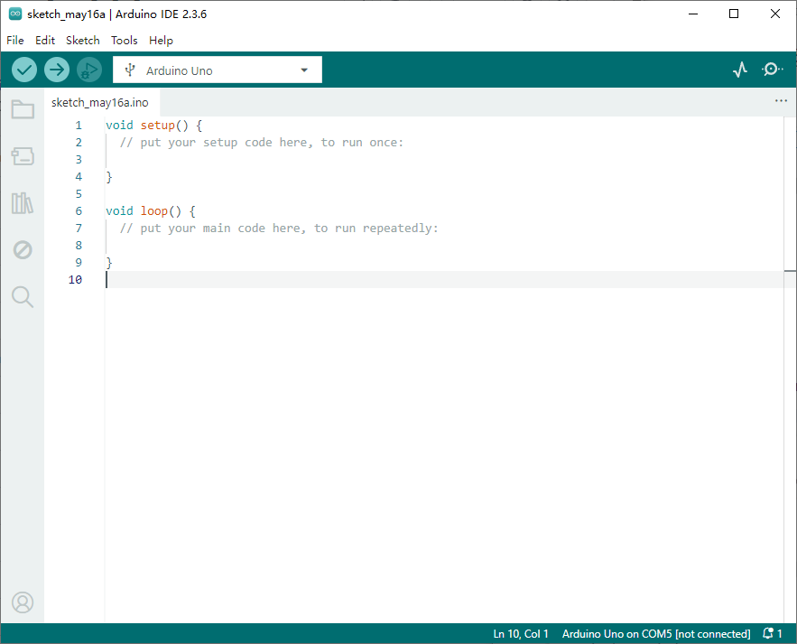
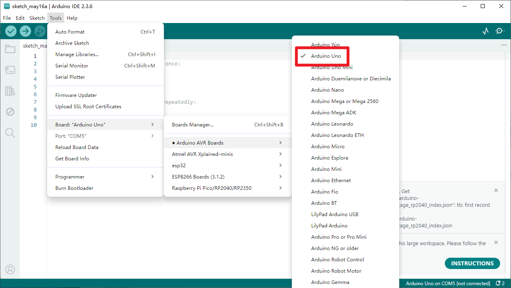
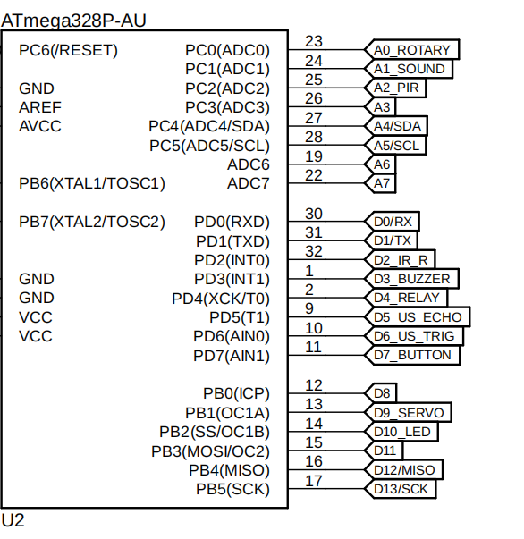

### 1, Product picture

### 2, Product version number

|      | Hardware | Software | Remark |
| ---- | -------- | -------- | ------ |
| 1    | V1.0     | V1.0     | latest |

### 3, product information

- Main Processor IC: ATmega328P

- Interface: Type-C

- Size: 195*170*46mm

- Material: PP

- Weight: 380g

  |                         | [All-in-one Starter Kit for Arduino](https://www.elecrow.com/all-in-one-starter-common-board-kit-for-arduino-with-15-sensors-and-21-lessons.html) |
  | ----------------------- | ------------------------------------------------------------ |
  | Main Processor          | ATmega328P                                                   |
  | Number of Sensors       | 15 sensors (including 1 humidity sensor)                     |
  | Sensor Board Design     | Integrated sensor board, no soldering or complex wiring required |
  | Screen                  | None                                                         |
  | Ambient Lights          | None                                                         |
  | Built-in Mini Games     | No                                                           |
  | Expansion Interfaces    | 6 Crowtail interfaces (3x I/O, 2x I2C, 1x UART)              |
  | Programming Environment | Based on Arduino software                                    |
  | Number of Tutorials     | 21 creative tutorials                                        |
  | Dimension               | 195×170×46 mm                                                |
  | Target Audience         | Students, teachers, hardware enthusiasts                     |
  | Application Scenarios   | Ideal for learning Arduino programming basics                |

### 

### 4,Quick Start

##### Arduino IDE starts

1.Download the library files used by this product to the 'libraries' folder.

C:\Users\Documents\Arduino\libraries\

2.Open the Arduino IDE

3.Open the code configuration environment and burn it

### 6,Folder structure.

|--3D file： Contains 3D model files (.stp) for the hardware. These files can be used for visualization, enclosure design, or integration into CAD software.

|--Datasheet: Includes datasheets for components used in the project, providing detailed specifications, electrical characteristics, and pin configurations.

|--Eagle_SCH&PCB: Contains **Eagle CAD** schematic (`.sch`) and PCB layout (`.brd`) files. These are used for circuit design and PCB manufacturing.

|--example: Provides example code and projects to demonstrate how to use the hardware and libraries. These examples help users get started quickly.

|--factory_firmware: Stores pre-compiled factory firmware that can be directly flashed onto the device. This ensures the device runs the default functionality.

|--factory_sourcecode: Contains the source code for the factory firmware, allowing users to modify and rebuild the firmware as needed.

### 7,Pin definition

